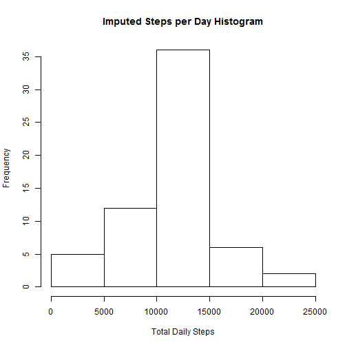

Personal Activity Analysis
==========================


### Background
This analysis was done for a peer-review assignment in the Johns Hopkins Reproducible Research course hosted by Coursera.  The assignment objective is to learn principles of reproducible research using the R statistical language and the R Markdown language.  The R knitr package is used to process the R Markdown file.

The data to be analysed represents two months of personal activity, measured in human steps, for an anonymous individual collected by a Fitbit-like device.  The raw activity data is provided as a comma separated value file with three variables (steps, date, and interval) and 17,568 observations.   


### Load and pre-process the data
A cursory review of the raw CSV file using *notepad++* revealed that the file employed standard CSV storage conventions and contained a number of missing values in the *steps* field, encoded as NA.  Hence I read the data into data frame **ra** (for **raw activity**) and then removed the missing values using the *is.na* function to create the **clean activity** object **ca**.


```r
ra <- read.csv("activity.csv")  # raw activity data
ca <- ra[!is.na(ra$steps),]     # clean activity data
```


### Examine mean total steps per day
To study the mean total number of steps taken per day, I first summed the clean activity steps by date using *tapply*, and then constructed a simple histogram.


```r
byDate <- tapply(ca$steps, ca$date, sum)
hist(byDate, 
     main = "Steps per Day Histogram", 
     xlab = "Total Daily Steps")
```

 

By default, the histogram binned daily steps into 5000-step bins.  The most common bin is 10k-15k steps per day, which accounts for more than 25 days.

I then examined the mean and median number of steps per day:


```r
mean(byDate, na.rm=T)
```

```
## [1] 10766.19
```

```r
median(byDate, na.rm=T)
```

```
## [1] 10765
```
Both results are within the most common bin.  They are also quite similar, indicating a low level of skewness.

### Examine average daily activity
To study the average day, I first averaged the number of steps in the clean activity data within each 5 minute interval over the entire two month period and then graphed the resulting **byInterval** object as a line plot.  


```r
byInterval <- tapply(ca$steps, ca$interval, mean)
plot(byInterval, 
     type = "l", 
     xlab = "Time Interval", 
     ylab = "Average Steps", 
     main = "Average Daily Activity")
```

 

Given 288 five minute time intervals per day, it is clear that the plot's horizontal axis is labelled by interval index.

Examining the line plot, it appears that our anonymous test subject usually sleeps until about interval 70 (~5:50).  He or she then averages about 50 steps per five minutes until trailing off around interval 230 (~19:10).  There is, however, a substantial peak around interval 100.


```r
max(byInterval)
```

```
## [1] 206.1698
```

```r
which.max(byInterval)
```

```
## 835 
## 104
```
More specifically, the peak in average steps per interval consists of 206.2 steps in interval 104, which is from 8:35 to 8:40.  Perhaps our subject exercises around this time.


### Impute missing values
We're next asked to examine possible effects of missing data.  

Using the original raw activity data ...


```r
sum(is.na(ra$steps)) ## Count missing values
```

```
## [1] 2304
```

... we see that there are 2304 missing values, which represents about 13% of our observations.

I'll impute values to them by creating a copy of the raw activity data, called **impute**, and then replace each missing value with the average for that interval, which I previously calculated in the **byInterval** object.


```r
impute <- ra
for (i in seq_along(impute$steps)) {
  if (is.na(impute$steps[i])) {
    impute$steps[i] = 
      byInterval[names(byInterval) == impute$interval[i]]
  }
}
```

Then, I'll repeat the "mean total steps per day" analysis using the imputed data:


```r
byDay2 <- tapply(impute$steps, impute$date, sum)
hist(byDay2, 
     main = "Imputed Steps per Day Histogram", 
     xlab = "Total Daily Steps")
```

 

Though the shape of the histogram appears the same as before, the scale has clearly increased.


```r
mean(byDay2, na.rm=T)
```

```
## [1] 10766.19
```

```r
median(byDay2, na.rm=T)
```

```
## [1] 10766.19
```

The mean is the same as before, but the median is now the same as the mean.  Before the median was 10765, which is slightly less than the mean.

#### Why are there differences between the cleaned and imputed data?
When I first examined the initial rows of the raw CSV file with *notepad++*, I noticed that values appeared to be missing for entire days.  It was almost as if our subject either forgot to wear the device or didn't save that day's data.  Let's check and see if that pattern holds true throughout the entire two month period.  First, I'll count the number of missing values by day in **missingByDay**, then I'll check to see how many days were missing all 288 step values.


```r
missingByDay <- tapply(is.na(ra$steps), ra$date, sum)
# length(missingByDay[missingByDay == 288])  ## Not used as ...
sum(missingByDay == 288)                     ## ... this is less code
```

```
## [1] 8
```

So 8 days are missing all values.  Also, 8 x 288 = 2304, which is our total number of missing values.  Thus, each day in the sample either had all values missing or no values missing.  This explains the increase in the *Frequency* scale.


```r
names(missingByDay[missingByDay == 288])
```

```
## [1] "2012-10-01" "2012-10-08" "2012-11-01" "2012-11-04" "2012-11-09"
## [6] "2012-11-10" "2012-11-14" "2012-11-30"
```

Looking at the specific missing dates, and a calendar for 2012, I see no identifiable pattern for the missing dates.


### Differences between weekday and weekend activity patterns   
Does our subject act differently on weekends than on weekdays?  To check, I create a new object **da**, for **different activity**, and then add an indicator variable for weekend versus weekday.  I load this indicator with dummy values, then replace the dummy values with either "WeekDay" or "WeekEnd" as appropriate.  I then count the number of dummy, weekday, and weekend values to ensure the indicator is correctly populated.


```r
da <- impute
da$type <- "dummy"

weekDay <- c("Monday",   "Tuesday", "Wednesday", "Thursday", "Friday")
weekEnd <- c("Saturday", "Sunday")

da$type[weekdays(as.Date(da$date)) %in% weekDay] <- "WeekDay"
da$type[weekdays(as.Date(da$date)) %in% weekEnd] <- "WeekEnd"

sum(da$type == "dummy")
```

```
## [1] 0
```

```r
sum(da$type == "WeekDay")
```

```
## [1] 12960
```

```r
sum(da$type == "WeekEnd")
```

```
## [1] 4608
```

There are no remaining dummy values, and the ratio of weekend to weekday days is 0.3555556, which is appropriate, given that the period covered nine weeks minus two weekend days.  

Next, using the imputed data, I average the data over two factors, time interval and date type (weekday versus weekend), then construct a line plot comparing the weekend pattern to the weekday pattern.


```r
library(lattice)
byType <- 
  aggregate(da$steps, 
            by = list(Type = da$type, Interval = da$interval), 
            FUN = "mean")
names(byType)[3] <- "Steps"  ## Support default xyplot label schema
xyplot(Steps ~ Interval | Type, 
       data = byType, 
       type = "l", 
       layout = c(1, 2))
```

 

Here the horizontal axis is labelled by the interval name (time that the interval starts), instead of the interval index, which appeared on the histograms.

It seems that our subject wakes up a bit later on weekends, and the weekend 'exercise' period is not as intense.  


```r
tapply(da$steps, da$type, mean)
```

```
##  WeekDay  WeekEnd 
## 35.61058 42.36640
```

But, our subject still walks more steps on weekend days than on weekdays.


### Summary
This was an interesting exercise and the use of R Markdown and knitr is a convenient way to produce a report.  I would appreciate a built in spell-checker, but one cannot complain for free.

The exercises we performed on the data set were useful in furthering our R skills, but the extreme variation in the data limited definite conclusions.
